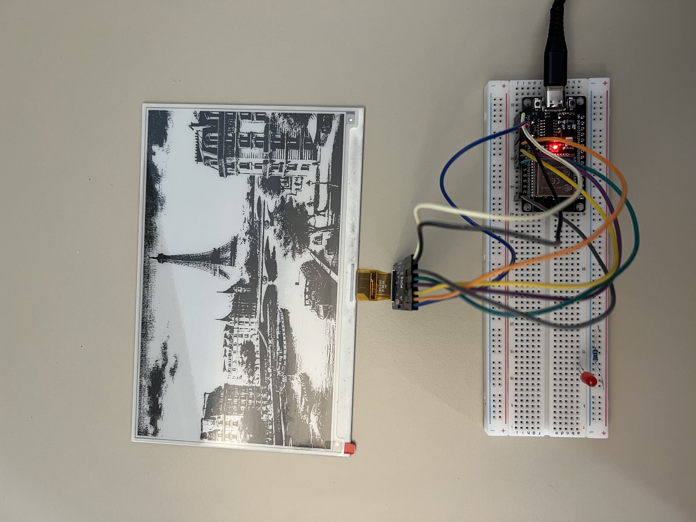
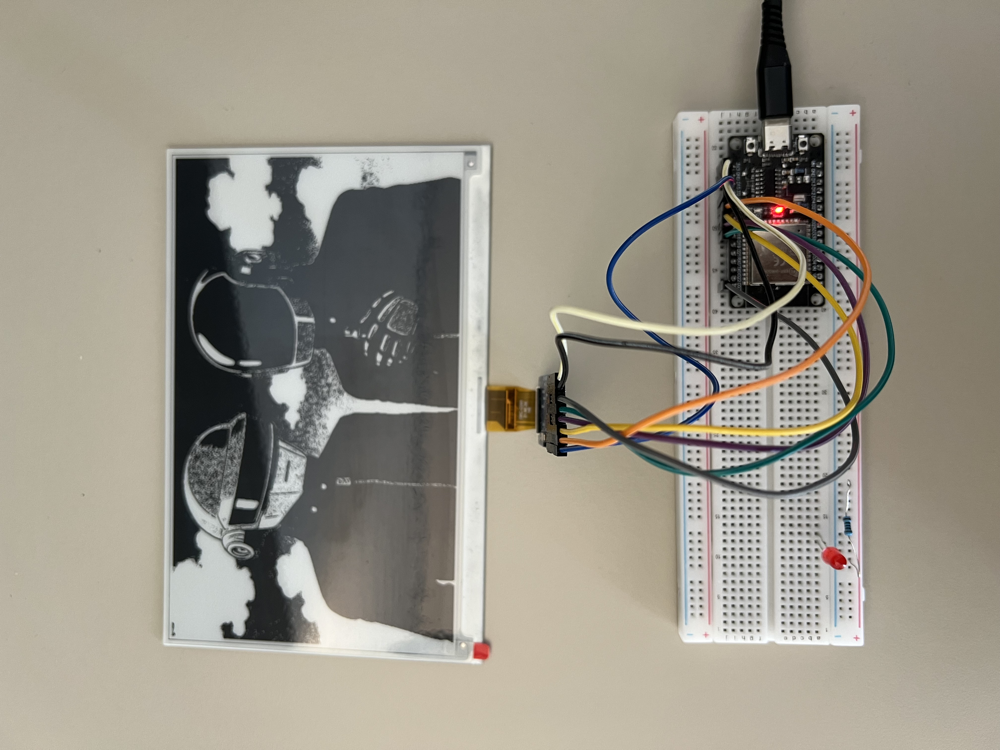
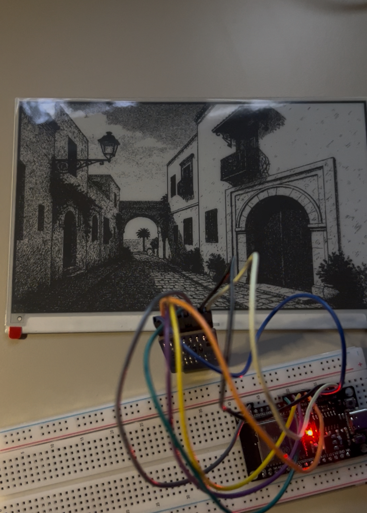

# Warka -- Your React e-ink Display

Warka has 3 components:

1. Frontend that is displayed in the e-ink paper, coded in React
2. Backend server, coded in Python (Flask) that:
   - Serves the endpoints used by the frontend
   - Screenshots the frontend and stores it in a bmp file to be retrieved by the ESP32
   - Serves a config file to the ESP32 (to dynamically control screen refresh rate, etc.)
3. An ESP32 that fetches the bmp screenshot file from the backend server and displays it in the e-paper, coded in C++.

With this architecture, you can now iterate super fast on your display and draw anything really quickly.

No need to hardcode your icons in C++ anymore. No need to worry about the size of your text.

The design burden is now on the frontend (React) side. You can implement a dashbaord, a calendar, a news feed, a dynamic weather display, a screensaver... Up to your imagination!


## 🚀 Features

- 📈 **Stock Market Data**: Real-time stock prices with daily changes and ranges
- 🌤️ **Weather Forecast**: multi-day weather outlook for Paris with sunrise/sunset times
- 💼 **Portfolio Holdings**: Personal investment portfolio overview with real-time valuations
- 📰 **Hacker News**: Top trending posts from Hacker News
- 📸 **Screenshot Capture**: Automated e-ink screenshot functionality with BMP optimization
- 🔌 **ESP32 Integration**: Chunked data transfer for microcontroller memory constraints
- ⚡ **Real-time Data**: Live updates via Yahoo Finance and OpenWeatherMap APIs

## Hardware
The hardware is very simple. You need:
- ESP32: I used [this one](https://fr.aliexpress.com/item/1005005704190069.html?spm=a2g0o.order_list.order_list_main.10.56ee5e5bnYfjPc&gatewayAdapt=glo2fra)
- E-INK display: I used the [GooDisplay 7.5 inch](https://fr.aliexpress.com/item/1005002870223620.html?spm=a2g0o.order_list.order_list_main.15.56ee5e5bvOrIsx&gatewayAdapt=glo2fra)
- E-INK adapter: I used the [GooDisplay adapter](https://fr.aliexpress.com/item/1005004633084221.html?spm=a2g0o.order_list.order_list_main.14.56ee5e5bvOrIsx&gatewayAdapt=glo2fra)
- power supply: I used my laptop as a power supply but you can also use a power bank or a 5V power supply
- a few jumper wires to connect the ESP32 to the E-INK display

### Wiring

Here is how to wire the ESP32 to the E-INK display:

| ESP32 Pin     | E-INK Pin |
|---------------|-----------|
| GND           | GND       |
| 3.3V          | 3.3V (VCC)|
| GPIO D4       | Busy      |
| GPIO D16      | RES       |
| GPIO D17      | D/C       |
| GPIO D5       | CS        |
| GPIO D18      | SCK       |
| GPIO D23      | SDI       |


## 🚀 Quick Start

### Install and run

1. **Set up the backend:**
  -  **Download ChromeDriver:**
    - Visit [Chrome for Testing]  (https://googlechromelabs.github.io/chrome-for-testing/)
    - Download ChromeDriver for your system
    - Extract to `backend/chromedriver/chromedriver`
    - Verify: `./backend/chromedriver/chromedriver --version`
  - **Backend Configuration:**
    - Edit `warka/backend/config.py`:

    ```python
    FRONTEND_URL = "http://localhost:5173"
    OPENWEATHER_API_KEY = "your_openweather_api_key_here"
    ```

  - **Install dependencies:**
   ```bash
   cd backend
   python -m venv venv
   source venv/bin/activate  # On Windows: venv\Scripts\activate
   pip install -r requirements.txt
   python server.py
   ```
   Backend runs on `http://localhost:8000`


2. **Set up the frontend:**
   ```bash
   cd frontend
   npm install
   npm run dev
   ```
   Frontend runs on `http://localhost:5173`


### Demo
This is the main dashboard of Warka. It displays the date, the weather forecast, the stock market, the current top hacker news posts and an overview of my portfolio.


But you can also easily display any image.

### Warka - Screensavers

<center><em>Paris</em></center>


<center><em>Daft Punk</em></center>


<center><em>Tunis - Sidi Bou Said</em></center>

### Warka - Daft Punk refresh
<iframe width="480" height="800" src="http://www.youtube.com/embed/aL0Z7EtoWpk" frameborder="0"> </iframe>


## 🔌 ESP32 Integration

The dashboard is designed to work with ESP32 microcontrollers:

1. **Image Fetching**: ESP32 requests screenshot data via `/image` endpoint
2. **Chunked Transfer**: Data sent in manageable chunks for memory constraints
3. **BMP Format**: 1-bit monochrome images optimized for e-ink displays
4. **Configuration**: ESP32 settings served via `/config` backend endpoint
5. **Low Power**: Designed for battery-powered operation

### Real-time Updates

- Stock prices: Updated every 5 minutes
- News feed: Updated every 15 minutes
- Weather: Updated every 30 minutes
- Holdings: Updated every 5 minutes

### E-ink Display Optimization

- Fixed 800x480 resolution layout
- High contrast black and white design
- Optimized for readability on e-ink screens
- Automated screenshot functionality

### Data Visualization

- Stock price changes with percentage indicators
- Weather icons and temperature ranges
- Portfolio allocation percentages
- News engagement metrics

## 🐛 Troubleshooting

### Common Issues

**Backend not starting:**
- Ensure all Python dependencies are installed
- Check that port 8000 is available
- Verify OpenWeatherMap API key is valid

**Frontend not loading data:**
- Confirm backend is running on port 8000
- Check browser console for CORS errors
- Verify API endpoints are responding

**Screenshot functionality not working:**
- Ensure ChromeDriver is installed and executable
- Check Chrome/Chromium is installed on system
- Verify frontend URL is accessible from backend

**Stock data not loading:**
- Yahoo Finance API may have rate limits
- Check internet connectivity
- Verify ticker symbols are valid

## 🤝 Contributing

Contribution is welcome and encouraged. Please follow these guidelines:

1. Fork the repository
2. Create a feature branch (`git checkout -b feature/amazing-feature`)
3. Commit your changes (`git commit -m 'Add amazing feature'`)
4. Push to the branch (`git push origin feature/amazing-feature`)
5. Open a Pull Request

---

**Built with ❤️ for the esp32 and e-ink display community**
